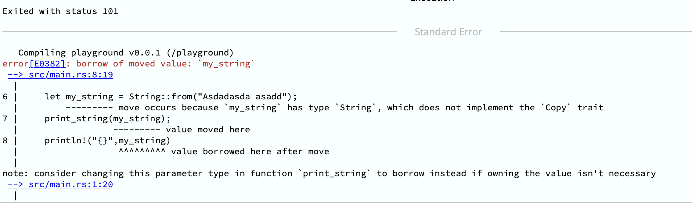

# Capitulo 2

Nesse capitulo avançaremos em alguns outros conceitos básicos

- Memória
- _String_ e _&str_
- _conts_ vs _let_ vs _static_
- Exemplos de Referência e _Borrow_
- _Trait_ Copy

## Memória

Entender a pilha, o heap, ponteiros e referências é muito importante em Rust. Começaremos com a pilha e o heap, que são dois lugares para armazenar memória em computadores. Aqui estão alguns pontos importantes a serem lembrados:

- A pilha é muito rápida, mas o heap não é tão rápido. Não é super lento também, mas a pilha geralmente é mais rápida.
- A pilha é rápida porque é como uma pilha: a memória para uma variável é empilhada em cima da última, bem ao lado dela. Quando uma função termina, ela remove o valor das variáveis começando pela última que foi adicionada, e agora a memória é liberada novamente. Alguns comparam a pilha a uma pilha de pratos: você coloca um em cima do outro, e se quiser desempilhá-los, tira primeiro o de cima, depois o próximo de cima, e assim por diante. Os pratos estão todos bem em cima uns dos outros, então são rápidos de encontrar. Mas você não pode usar a pilha o tempo todo.
- Rust precisa saber o tamanho de uma variável em tempo de compilação. Então variáveis simples como _i32_ podem ir na pilha porque conhecemos seu tamanho exato. Sempre sabemos que um _i32_ tem 4 _bytes_ porque 32 _bits_ = 4 _bytes_. Então, _i32_ sempre pode ir na pilha.
- Alguns tipos não conhecem o tamanho em tempo de compilação. E ainda assim, a pilha precisa saber o tamanho exato. E agora? Primeiro, colocamos os dados no heap porque o heap pode ter qualquer tamanho de dados. (Você não precisa fazer isso você mesmo; o programa pede ao computador um pedaço de memória para colocar os dados.) E então, para encontrá-lo, um ponteiro vai para a pilha. Isso é bom porque sempre conhecemos o tamanho de um ponteiro. Então, o computador primeiro vai para o ponteiro, lê as informações de endereço e as segue até o heap onde estão os dados.
- Às vezes, nem mesmo podemos usar memória do heap! Se você estiver programando em Rust para um dispositivo embarcado pequeno, vai ter que usar apenas memória da pilha. Não há sistema operacional para pedir memória do heap em um dispositivo embarcado pequeno.

Ponteiros (que às vezes são chamados de _references_) podem parecer complicados, mas não precisam ser. Ponteiros são como um sumário de um livro.

Exemplo (Variável, Ponteiro e dereference)

```rust
let my_variable = 8;
let my_reference = &my_variable;
let my_double_reference = &&my_variable;
```

OBS: Rust tenta ao máximo possível dereferenciar

## _String_ e _&str_

Rust tem dois tipos principais de strings: String e &str. Por que existem dois tipos e qual é a diferença?

- Um _&str_ é uma string simples (é um Ponteiro). Com o ponteiro para os dados mais o comprimento, o Rust pode ver onde começa e onde termina. Quando você escreve `let my_variable = "Hello, world!"`, você cria um &str. Também é chamado de _slice string_. Isso porque &str usa o ponteiro para encontrar os dados e o comprimento (_lenght_) para saber até onde olhar na memória. Pode ser apenas uma visão parcial dos dados pertencentes a alguma outra variável, apenas um _slice_ deles.

- String é uma string um pouco mais complicada. Pode ser um pouco mais lenta, mas tem mais funcionalidade. Uma String é um ponteiro com dados no **heap**. A maior diferença é que uma String possui seus próprios dados, enquanto um &str é um _slice_ (uma visão de alguns dados). Uma String é fácil de expandir, reduzir, mutar, e assim por diante.

Além disso, observe que &str tem o & na frente porque você precisa de uma referência para usar um str pela mesma razão anteriormente discutida: a _stack_ precisa saber o tamanho, e um str pode ter qualquer comprimento. Portanto, acessamos com um &, uma referência. O compilador conhece o tamanho do ponteiro de uma referência e pode então usar o & para encontrar onde os dados str estão e lê-los. Além disso, porque você usa um & para interagir com um str, você não é o proprietário dele. Mas uma String é um tipo _"owned"_.

Tanto &str quanto String são codificados com UTF-8, que é o sistema de codificação de caracteres principal usado em todo o mundo.

Há muitas maneiras de criar uma string. Aqui estão algumas:

- `String::from("Este é o texto da string");` — Este é um método para String que recebe texto e cria uma string.
- `"Este é o texto da string".to_string()` — Este é um método para &str que o transforma em uma String.
- O macro `format!` — Isso funciona exatamente como `println!`, exceto que cria uma string em vez de imprimir. Então você pode fazer isso:

```rust
let size_of_string = std::mem::size_of::<String>();
let pt_String = String::from("Gabriel Mizuno");
let pt_String2 = String::from("Gabriel Mizuno Gabriel Mizuno Gabriel Mizuno Gabriel Mizuno Gabriel MizunoGabriel Mizuno");
let size_of_i8 = std::mem::size_of::<i8>();
let size_of_f64 = std::mem::size_of::<f64>();
let size_of_korea = std::mem::size_of_val("자우림");
let size_of_pt = std::mem::size_of_val("Gabriel Mizuno");
let size_of_pt2 = std::mem::size_of_val("Gabriel Mizuno Gabriel Mizuno Gabriel Mizuno Gabriel Mizuno Gabriel MizunoGabriel Mizuno");

println!("Memory size of String {size_of_string} bytes.");
println!("Memory size of String in PT: 'Gabriel Mizuno' {} bytes.", std::mem::size_of_val(&pt_String));
println!("Memory size of String in PT: {} bytes.", std::mem::size_of_val(&pt_String2));
println!("Memory size of i8 {size_of_i8} bytes.");
println!("Memory size of f64 {size_of_f64} bytes.");
println!("Memory size of &str in Koerea: '자우림' is {size_of_korea} bytes.");
println!("Memory size of &str in PT: 'Gabriel Mizuno' {size_of_pt} bytes - not Sized.");
println!("Memory size of &str in PT: {size_of_pt} bytes - not Sized.");
```

De maneira resumida, podemos usar _String_ ou _&str_ nos seguintes cenários

- Use _String_ quando você precisa possuir e modificar a string dinamicamente. Uma String é uma string de propriedade que pode ser modificada, aumentada ou encolhida durante a execução do programa.
- Use _&str_ quando você tem uma referência a uma sequência de caracteres, mas não precisa possuir ou modificar a string diretamente. Um _&str_ é uma fatia de uma sequência de caracteres e é imutável por padrão. Ele é útil quando você só precisa acessar ou passar uma referência a uma string existente, sem a necessidade de modificá-la.

## _conts_ vs _let_ vs _static_

Existem duas outras maneiras de declarar valores sem a palavra-chave let. Estas duas são conhecidas como _const_ e _static_. Outra diferença é que o Rust não usará _type inference_ para elas: **você precisa escrever o tipo delas**. Essas são para valores que não mudam (_const_ significa constante). Bem, tecnicamente, static pode mudar, mas aprenderemos sobre isso mais tarde. As duas principais diferenças são:

- _const_ é para valores que não mudam e são criados em tempo de compilação.
- _static_ é semelhante a const, mas tem uma localização de memória fixa. Pode não ser criado em tempo de compilação.
- _static_ e _const_ são utéis para criar variáveis globais (melhores práticas são nomear as variáveis globais com letra maiúsculas)

```rust
const MY_CONTS_NUMBER: u32 = 12;
static MY_STATIC_VECTOR: [&str; 4] = ["Spring", "Summer", "Fall", "Winter"];

fn print_numbers() {
    println!("My number is {} and my vector is {:?}", MY_CONTS_NUMBER, MY_STATIC_VECTOR)
}

fn main() {
    print_numbers()
}
```

## Referência

Nessa seção vamos mostrar alguns exemplos sobre referência que serão importantes para os próximos capítulos.

Exemplo 1 - Erro 'referência morta'

```rust
fn return_str() -> &String {
    let country = String::from("Austria");
    let country_ref = &country;
    country_ref
}

fn main() {
    let country = return_str();
}
```

No exemplo acima, o compilador retornará o seguinte erro _returns a value referencing data owned by the current function_. Isso ocorre pois

A função _return_str()_ cria uma _String_ e depois cria uma referência (ponteiro) para essa _String_. Em seguida, tenta retornar essa referência. No entanto, a _String_ atribuida á _country_ só existe dentro da função e depois é **descartada** (lembre-se, uma variável só existe enquanto o bloco de código (escopo) está em execução). Uma vez que uma variável desaparece, o computador limpa a memória para que ela possa ser usada para outra coisa. Portanto, depois que a função retorna, _country_ref_ estaria se **referindo a uma memória que já não existe**. Definitivamente não está certo! Rust impede que cometamos um erro de memória aqui. Esta é a parte importante sobre o tipo _"owned"_ que discutimos anteriormente. Porque você possui uma _String_, pode passá-la ao redor. Mas um _&String_ morrerá se sua _String_ morrer, e você não passa a propriedade com ele.

Exemplo 2 - Mutable Reference

Esse exemplo explicará mais sobre referência e mutabilidade

```rust
let mut my_number = 8;
let num_ref = &mut my_number;
*num_ref += 10;
println!("{}", my_number);
let second_number = 800;
let triple_reference = &&&second_number;
println!("Are they equal? {}", second_number == ***triple_reference);
```

No exmeplo acima _my_number_ é um i32, e _num_ref_ é &mut i32. Em linguagem informal, você chama isso de "referência mutável para um i32" ou "ref mut i32".

Em seguinda adicionamos 10 a _my_number_. No entanto, você não pode escrever num_ref += 10 porque num_ref não é o valor i32; é uma &i32. Não há nada para adicionar dentro de uma referência. O valor a ser adicionado está realmente dentro do i32. Para chegar ao local onde o valor está, usamos \*. Usar \* permite que você vá da referência para o valor por trás da referência. Em outras palavras, \_ é o oposto de &. Além disso, um \_ apaga um &.

O Exemplo 2 demonstra dois conceitos (mutabiliade e referência). Ele usa \* para alterar o valor de um número através de uma referência mutável e mostra que um \* equivale a um &.

De maneira mais formal, Rust tem duas regras para referências mutáveis e imutáveis. Elas são muito importantes, mas fáceis de lembrar porque fazem sentido:

- **Regra 1 (referências imutáveis)** - Você pode ter quantas referências imutáveis quiser: 1 está bem, 3 estão bem, 1.000 estão bem. Não há problema porque você está apenas visualizando os dados.
- **Regra 2 (referências mutáveis)** - Você só pode ter uma referência mutável. Além disso, você não pode ter uma referência imutável e uma referência mutável juntas.

Como as referências mutáveis podem alterar os dados, você poderia ter problemas se alterasse os dados quando outras referências estivessem lendo-os. Uma boa maneira de entender é pensar em uma apresentação feita com Powerpoint ou no Google Docs. Vamos analisar algumas situações de propriedade através de uma comparação com a vida real e determinar se estão ok ou não.

## _Copy_ e _Clone_ _Trait_

Em Rust, os tipos mais simples (inteiros, float, char e &str) são conhecidos como tipos _Copy_ (implementam a _Trait_ _Copy_). Eles estão todos na _stack_ e o compilador sabe o tamanho deles. Isso significa que são muito fáceis de copiar, então o compilador sempre copia seus dados quando você envia esses tipos para uma função. Os tipos Copy são tão pequenos e simples que não há motivo para não copiá-los.

Exemplo 1 - Erro

```rust
fn print_string(s: String){
    println!("{}", s)
}

fn main() {
    let my_string = String::from("Asdadasda asadd");
    print_string(my_string);
    println!("{}",my_string)
}
```

Esse erro ocorre porque estamos tentando usar _my_string_ após ela ter sido movida para a função _print_string()_. Em Rust, quando você passa um valor para uma função, ele pode ser movido para a função, o que significa que o valor original não está mais disponível no escopo atual. Como _String_ não implementa o trait _Copy_, ele sofre um _move_ em vez de _Copy_ quando passado para a função. Nesse caso dizemos que _my_string_ perde o _ownership_.

Para contornar esse tipo de problema, existe outra _Trait_ chamada de _Clone_. De forma mais informal _Clone_ é semelhante a _Copy_, mas geralmente requer mais memória. Além disso, você precisa chamar _.clone()_ explicitamente - ele não será clonado automaticamente da mesma forma que os tipos _Copy_ se copiam sozinhos.

Exemplo 2 - Corrigindo Exemplo 2

```rust
fn print_string(s: String){
    println!("{}", s)
}

fn main() {
    let my_string = String::from("Asdadasda asadd");
    print_string(my_string.clone());
    println!("{}",my_string)
}
```

Dessa forma podemos usar a seguinte regra geral: se você puder usar uma referência imutável, opte por isso. Você não terá que se preocupar com uma função assumindo a propriedade de alguns dados: a função simplesmente dará uma olhada e terminará. Para funções, se você não precisar transferir a propriedade, uma referência é sempre a opção mais fácil!


