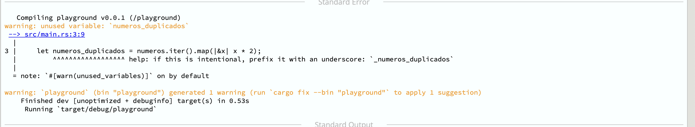

## Capítulo 8

Neste capítulo, vamos ver muito do estilo funcional do Rust, que é baseado em expressões. Esse estilo permite que você use um método que fornece uma saída, essa saída se torna a entrada do próximo método, e você repete até obter a saída final desejada. _Iterators_ e _Closures_ são de grande ajuda aqui, então eles são o foco principal deste capítulo.

- Iterators
- Clousers

## Iterators

Um iterador é como um tipo de coleção que fornece seus itens um de cada vez. É um pouco como alguém distribuindo um baralho de cartas. Você pode pegar uma carta de cada vez até que o baralho acabe. Ou você pode pegar a quinta carta. Ou pode pular 10 cartas e pegar as próximas 10. Ou pode pedir a 60ª carta e ser informado de que não há 60ª carta no baralho.
Já usamos iteradores muitas vezes porque o loop for nos dá um iterador. Quando você deseja usar um iterador, precisa escolher o tipo:

- `.iter()` — Para um iterador de referências.
- `.iter_mut()` — Para um iterador de referências mutáveis.
- `.into_iter()` — Para um iterador de valores (não referências).

Exemplo 1 - Usa básico de iteradores

```rust

fn main() {
    let vector1 = vec![1, 2, 3];
    let mut vector2 = vec![10, 20, 30];

    for num in vector1.iter() {
        // itera sobre uma REFERENCIA
        println!("Printing &i32: {num}");
    }

    for num in vector2.iter_mut() {
        // itera sobre uma REFERENCIA MUTAVEL
        println!("num is {num} before transformation");
        // num *= 10 da erro pois eh um referencia
        *num *= 10;
        println!("num is now {num}");
    }

    println!("{vector2:?}");

    println!("{vector1:?}");

    for num in vector1.into_iter() {
        println!("Printing i32: {num}");
    }

    // println!("{vector1:?}") vector1 sofre um move no segundo for
}

```

OBS: No livro usado como fonte de estudo é abordado tópicos mais avançado sobre _iterators_, porém nesse primeiro momento será omitido esses tópicos.

## _Clousers_

Closures são funções rápidas que não precisam de um nome, ou seja, funções anônimas. Às vezes, em outras linguagens, são chamadas de lambdas. É fácil identificar onde estão os closures porque eles usam || em vez de (). Eles são muito comuns em Rust, e uma vez que você aprende a usá-los, vai se perguntar como viveu sem eles.

Exemplo 1 - Criando closure

```rust
fn main() {
    let meu_closure = || println!("Este é um closure");
    meu_closure();
}
```

Exemplo 2 - Closure com parâmetro

```rust
fn main() {
    let meu_closure = |x: i32| println!("{x}");
    meu_closure(5);
    meu_closure(5 + 5);
}
```

Exemplo 3 - Closure "longa"

```rust
fn main() {
    let meu_closure = || {
        let numero = 7;
        let outro_numero = 10;
        println!("Os dois números são {numero} e {outro_numero}.");
    };
    meu_closure();
}
```

Uma coisa que torna os closures especiais é que eles podem pegar variáveis de seu ambiente que estão fora do closure, mesmo se você escrever apenas ||. Você pode pensar em um closure como um tipo independente que pode manter referências da mesma forma que uma struct pode.

- Um || que não inclui uma variável de fora é uma função anônima. Anônimo significa "não tem nome". Ele funciona mais como uma função regular e pode ser passado para lugares onde uma função é necessária se a assinatura for a mesma.
- Um || que inclui uma variável de fora também é anônimo, mas é chamado de closure. Ele "fecha" as variáveis ao seu redor para usá-las.

Mas as pessoas costumam chamar todas as funções || de closures, então você não precisa se preocupar muito com o nome. Vamos chamar qualquer coisa com um || de closure, mas lembre-se de que pode significar uma função anônima.

Exemplo 4 - Closure acessando variável externa

```rust
fn main() {
    let numero_um = 6;
    let numero_dois = 10;
    let meu_closure = |x: i32| println!("{}", numero_um + numero_dois + x);
    meu_closure(5);
}
```

Outro método muito usado junto com iteradores é método map(). A ideia básica por trás do método `map` é aplicar uma função a cada elemento da coleção e obter uma nova coleção contendo os resultados dessas aplicações. Em outras palavras, você está mapeando cada elemento da coleção para um novo valor com base em uma determinada função.

Por exemplo, imagine que você tenha um vetor de números e deseje duplicar cada número nesse vetor. Em Rust, você pode fazer isso usando o método `map`. Veja um exemplo:

Exemplo 5 - Usando map

```rust
fn main() {
    let numeros = vec![1, 2, 3, 4, 5];
    let numeros_duplicados: Vec<i32> = numeros.iter().map(|&x| x * 2).collect();
    println!("{:?}", numeros_duplicados);
}
```

Neste exemplo, `numeros.iter()` nos dá um iterador sobre os elementos de `numeros`. Em seguida, usamos `map` para aplicar a função de multiplicação (`|&x| x * 2`) a cada elemento do iterador. Finalmente, usamos `collect` para coletar os resultados em um novo vetor chamado `numeros_duplicados`.

Uma coisa interessante sobre `.map()` é que ela não faz nada a menos que você use um método como `.collect()`. Vamos dar uma olhada em `.map()` novamente, primeiro com `.collect()`. O exemplo abaixo mostra esse conceito.

Exemplo 6 - Zero-cost abstractions

```rust
fn main() {
    let numeros = vec![1, 2, 3, 4, 5];
    let numeros_duplicados = numeros.iter().map(|&x| x * 2);
}
```

O compilador retornar um _warning_ informado com numeros_duplicados não esta sendo usada



OBS: Se `let numeros_duplicados: Vec<i32> = numeros.iter().map(|&x| x * 2);` teremos um erro.
